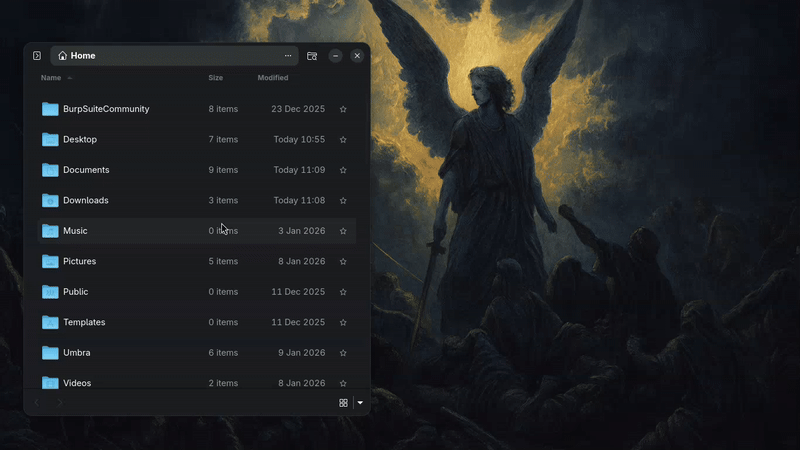
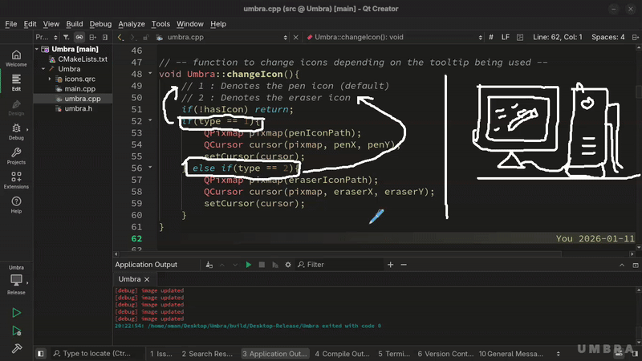
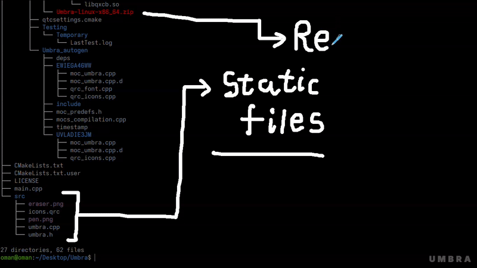

# Umbra

Umbra is a lightweight Linux utility tool for annotating over any window. It allows you to draw, erase, and annotate anywhere on your screen, making it useful for presentations, explanations, screenshots, or quick visual notes. It has been tested on both X11-based desktops and Wayland.

## Features

**Multiple colors**

**Any size you want**

**Erase**

## Installation

1. Download the latest release from the Releases page.
2. Extract the folder into a location of your choice.
3. The main binary is located at `bin/Umbra`.
4. Create a custom keyboard shortcut and bind it to the binary: `/path/to/Umbra/bin/Umbra`.

No system-wide Qt installation is required; all dependencies are bundled with the release.

## Usage

* Launch Umbra using your configured keyboard shortcut.
* A small watermark appears at the bottom-right corner, indicating the overlay is active.
* Press **Escape** to exit the application.
* **Right-click** opens the context menu to access tool properties.
* Use the **middle mouse button** to switch between pen and eraser.

### Pen Tool

* Change pen size using the slider.
* Change pen color depending on your system’s available options.

### Eraser Tool

* Right-click while erasing to change the eraser size.

### Keyboard Shortcuts

* **Ctrl + Z** — Undo last operation
* **Ctrl + C** — Clear entire canvas

These features are also available in the right-click context menu.

## Disclaimer

Umbra has been tested on a limited number of systems. The author is not liable for any adverse behavior, data loss, or system issues that may occur while using it. Use at your own discretion.

## Feedback & Contact

If you encounter bugs or have feature requests, contact: **[omannorz@gmail.com](mailto:omannorz@gmail.com)**

